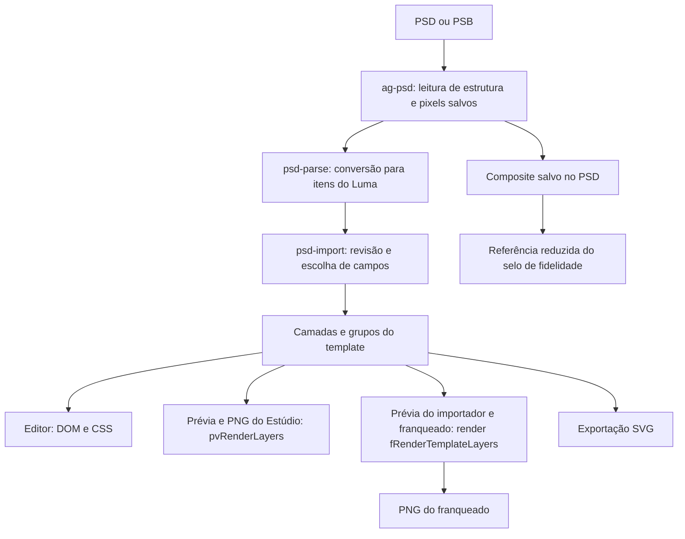

# Photoshop → Luma: estudo de fidelidade e roadmap

Data: 05/09/2026. Base auditada: branch `talpaipai`, commit `411195bd21df7df6a3ac5eeff8e29c79c6972b83`. Estudo e proposta; nenhuma alteração funcional implementada.

## 1. Decisão recomendada

O Luma deve garantir a fidelidade de **templates homologados**, preservando os pixels do Photoshop nas partes fixas e mantendo editáveis os elementos cuja reprodução foi comprovada. Para elementos que precisam mudar e dependem de recursos exclusivos do Photoshop, a alternativa é gerar cada variante no próprio motor Adobe.

Hoje não há evidência para afirmar “estamos em X%” nem para prometer “qualquer PSD, 100% editável, 100% igual”. Há perdas concretas na importação, diferenças entre os renderizadores e uma medição que pode anunciar 100% mesmo quando os pixels diferem.

O projeto já possui bastante infraestrutura aproveitável: leitura em worker, revisão por camada, pranchetas, fontes, caminhos vetoriais, máscaras, grupos, ajustes de cor e clipping dinâmico. A recomendação é evoluir essa base em entregas pequenas, sem reescrever o editor ou criar outro renderizador paralelo.

## 2. O que significa “100% igual”

| Objetivo | Definição verificável | Compromisso possível |
|---|---|---|
| Arte original estática | Mesmas dimensões, transparência e pixels do PNG de referência | Preservar a exportação original; validar qualquer decodificação/recomposição |
| Template com campos | A mesma variante, produzida no Photoshop e no Luma, deve coincidir | Certificar recursos, fontes, combinações e limites dos campos |
| PSD totalmente editável | Reproduzir todos os recursos e comportamentos de edição do Photoshop | Não é uma promessa sustentada pela arquitetura atual |
| Arquivo idêntico | Mesmos bytes, compressão e metadados | Devolver o arquivo original; pixels iguais não bastam |

Alterar “Pizza” para “Pizza de calabresa com borda” muda a arte. A referência correta passa a ser o Photoshop com esse mesmo texto e as mesmas regras de adaptação. Comparar a variante com o PNG original não mede fidelidade de edição.

“Visualmente aprovado com tolerância” é uma categoria útil, mas distinta de igualdade exata. Mesmo com 100% dos casos de um corpus aprovados, a garantia permanece limitada ao contrato e às combinações homologadas.

## 3. Como o fluxo funciona hoje

**Leitura:** `dImportPSD` aceita `.psd`/`.psb` e limita o arquivo a 500 MB. `dLoadAgPsd` tenta a biblioteca local e depois um CDN sem versão fixada. O worker lê imagens e metadados, transfere buffers e reconstrói canvases em fatias. Acima de 150 MB evita copiar o buffer original; isso economiza memória, mas limita o fallback quando o worker falha.

**Conversão:** `dPsdParseItems` transforma o documento em texto, forma, raster e ajuste; transporta a hierarquia por `_groupChain`. `dPsdItemsToLayers` materializa grupos e `parentId`. A revisão permite preservar texto ou convertê-lo em campo/imagem. Pranchetas múltiplas viram templates separados.

**Composição:** existem quatro caminhos reais. O mais completo é `fRenderTemplateLayers`, usado no fluxo do franqueado e na prévia do importador. A prévia/exportação do Estúdio continua com `pvRenderLayers`. O DOM do editor tem suas próprias aproximações; o SVG tem outra implementação.

**Referência:** o composite do PSD é usado para comparação reduzida; não é hoje um original de alta resolução preservado como contrato de exportação para todos os templates.

Pontos de entrada: `js/designer/psd-parse.js:18`, `:896`, `:1027`, `:1361`, `:1875`; `js/designer/psd-import.js:478`, `:616`, `:1527`; `js/franqueado/png-generator.js:413`; `js/designer/preview.js:106`.

## 4. Matriz de capacidade atual

“Implementado” significa que existe um caminho de código. Não significa que ele tenha sido homologado pixel a pixel contra o Photoshop.

| Recurso | Estado observado | Distância para fidelidade comprovada |
|---|---|---|
| PSD/PSB e pranchetas | Leitura e offsets implementados; parser local aceita versões 1 e 2 | Validar variantes reais, limites de memória e formatos de cor |
| Imagens e Smart Objects | Usa raster salvo; Smart Object perde edição interna | Preservar resolução/alpha; raster isolado não resolve efeitos externos |
| Texto simples | Importa fonte, tamanho, alinhamento, tracking, entrelinha e decorações | Heurísticas geométricas, arredondamentos, substituição de fonte e métricas diferentes |
| Texto com estilos mistos | Runs preservam parte dos atributos | Estilos por trecho incompletos; ao converter em variável, runs não são mantidos |
| Texto girado, espelhado, em curva ou warp | Vários casos caem em raster | Aparência depende dos pixels salvos; edição textual deixa de existir |
| Formas e Bézier | Primitivas, paths combinados e alguns traços editáveis | Booleanos, transformações e atributos vetoriais completos precisam de referência |
| Máscaras de camada | Composição alpha implementada | Redução de resolução, feather/density e semântica completa não certificadas |
| Clipping | Vínculo por ID e snapshot; PNG pode recalcular base editada | Editor/Estúdio podem usar snapshot; testar base editada e efeitos |
| Grupos | Hierarquia, isolamento, máscara, opacity e blend no PNG | DOM aproxima por filho; `pv*` não compõe a árvore |
| Mesclagem | Modos nativos e software | Equivalência matemática não certificada; Dissolve e Blend If sem caminho completo |
| Fill opacity | Dobrado em opacity quando não há efeitos | Não há canal independente preservado para conteúdo e efeitos |
| Sombras, contornos e brilhos | Suporte parcial, mais amplo em formas | Efeitos internos aproximados; pilhas e imagens diferem entre caminhos |
| Gradientes | Linear/radial e conversão de reflected | Geometria, pontos médios, escala/offset e estilos especiais incompletos |
| Ajustes de cor | Nove tipos no motor PNG | Algumas fórmulas são aproximações; ajustes não suportados não alteram pixels |
| ICC e profundidade | Sem política explícita no pipeline Luma auditado | Não basta o parser aceitar um arquivo; conversão e transporte precisam ser corretos |
| PNG no tamanho original | Dimensões nativas existem no material | Franqueado força 2×; exportação `pv*` consulta presets |
| Exportação PSD de volta | Não há exportação PSD real no fluxo auditado | A opção atual chama exportação SVG e anuncia PSD |

## 5. Achados que impedem a garantia

### 5.1 O selo atual não mede igualdade exata

Em `psd-import.js:648–705`, a comparação:

- reduz o lado maior para 400 px;
- compõe as duas imagens sobre branco;
- aceita diferença média RGB de até 16 por pixel;
- arredonda a porcentagem para inteiro;
- atribui divergências à caixa superior, sem analisar a cobertura alpha real de cada camada.

Isso pode ocultar bordas, diferenças de alpha e pequenos elementos. Na sondagem isolada da função real, comparar RGB `(240,240,240)` com `(255,255,255)` devolveu **100%**, pois a diferença média é 15. O arredondamento também permite 100% com uma pequena fração de pixels acima da tolerância.

Em `psd-import.js:712`, ausência de relatório exibe **“Fiel ao arquivo”**. Ausência de referência deveria resultar em “Não verificado”. O ranking por caixa é uma pista espacial, não prova de qual camada causou o erro.

### 5.2 Pixels são alterados antes da exportação

`_dPsdRasterURL` (`psd-parse.js:429`) usa JPEG para conteúdo classificado como opaco, com qualidade padrão 0,82; algumas rotas usam 0,92. Os limites são adaptativos em parte do parse, chegando a 3200 px. O fallback achatado usa teto de 2400 px. Máscaras normalmente têm teto de 1400 px (`:517`).

JPEG é incompatível com preservação exata. Reduzir e ampliar novamente também altera pixels. `_dPsdHasAlpha` (`:390`) amostra a imagem e trata alpha abaixo de 250 como sinal de transparência; pode deixar passar transparência sutil ou pequena fora da amostra.

A solução é separar **original sem perdas** de **miniatura para navegação**. O export deve acessar o original. Alterar apenas a qualidade JPEG para 1 não resolve.

### 5.3 “Rasterizar a camada” não equivale a exportar seu visual no Photoshop

O próprio importador reconhece que `node.canvas` não contém necessariamente efeitos de camada e tenta reaplicá-los (`psd-parse.js:1465`, `_dPsdApplyFx:1775`). Contudo, o ramo de imagens do PNG (`png-generator.js:1106`) desenha a imagem e filtros básicos, sem consumir os efeitos de camada que foram copiados.

Isso afeta, por exemplo, Smart Object com sombra externa e texto convertido em imagem por ter efeito incompatível. Não basta marcar `needsRaster`: é necessário ter os pixels finais da unidade visual completa ou um render que reproduza seus efeitos.

Em `dItemToLayer:1797`, fill opacity com efeitos marca `needsRaster`, mas não mantém um canal de fill separado. Uma sondagem com fill de 20%, opacity de 100% e sombra produziu layer com opacity de 100%, sem fill opacity. Essa sondagem confirma a perda no modelo; não é uma comparação de imagem Photoshop.

### 5.4 O Estúdio pode exportar diferente do franqueado

`preview.js:1047` chama o download que passa por `_pvRenderToBlobNow:500` e `pvRenderLayers:106`. Esse render não usa a árvore de grupos e ajustes do motor mais completo. Também não preserva todos os gradientes, runs e efeitos.

Há uma diferença concreta em máscara + blend nativo: o `pv*` desenha o offscreen no destino sem restaurar o blend (`:132`), enquanto o PNG do franqueado trata essa composição explicitamente (`png-generator.js:583`).

O DOM aplica opacity do grupo em cada filho (`canvas.js:188–215`). Dois filhos sobrepostos a 50% não produzem o mesmo resultado de compor ambos e aplicar 50% uma única vez. Há uma compensação parcial: ajustes de cor no editor usam snapshots cumulativos do motor PNG (`:1173`). Portanto, o problema não é simplesmente “o editor ignora tudo”; são caminhos com semânticas diferentes.

### 5.5 Texto é um problema de métricas e composição

O importador usa heurísticas para tamanho e caixa (`psd-parse.js:87`, `:115`), arredonda tracking (`:1506`) e remapeia fontes por correspondência exata ou prefixo (`:1119`). Isso ajuda a recuperar arquivos, mas não comprova a variante tipográfica exata.

O PNG acrescenta padding proporcional ao corpo (`png-generator.js:997`, `:1057`), arredonda coordenadas (`:684`) e usa baselines diferentes para texto simples e rico (`:880`, `:1040`). Runs importados preservam texto/cor/fonte/tamanho/tracking, mas não toda a tipografia do Photoshop; a conversão em variável não conserva os runs (`psd-parse.js:1850`).

A certificação precisa abranger o arquivo exato da fonte, peso/estilo, ligaturas/kerning relevantes, parágrafos, tracking fracionário, entrelinha, alinhamento, escala, rasterização e dados variáveis. Carregar uma fonte de mesmo nome não basta.

### 5.6 Cor e profundidade precisam entrar no contrato

O parser vendorizado possui uma lista efetiva de modos de cor que exclui CMYK (`assets/vendor/ag-psd.js:9634`, validação em `:9834`), mesmo havendo funções CMYK em outros trechos. Não se deve inferir suporte a partir de uma função isolada.

O cabeçalho aceita profundidades 1/8/16/32, mas o worker do Luma transporta buffers sem a informação de tipo/profundidade e os reconstrói como `Uint8ClampedArray` (`psd-parse.js:896–948`). Para imagens de 16/32 bits isso não representa uma conversão correta; precisa de caso real para delimitar exatamente falha, descarte ou corrupção em cada formato. Também não foi encontrado tratamento explícito de ICC nos caminhos Luma auditados.

Para a primeira certificação: cópia de intercâmbio **RGB, sRGB, 8 bits por canal**. Converter para o perfil é diferente de apenas atribuí-lo. Preservar o PSD mestre original. Essa recomendação se apoia nas orientações Adobe sobre [cor para web](https://helpx.adobe.com/ae_en/photoshop/using/color-managing-documents-online-viewing.html) e [conversão de perfil](https://helpx.adobe.com/photoshop/desktop/adjust-color/color-profiles/change-color-profile-for-documents.html).

### 5.7 A importação pode excluir camadas legítimas

O dedupe em `psd-parse.js:1659` usa nome, tipo, caixa, conteúdo e alguns atributos, mas não a identidade original da camada nem toda a composição. Duas camadas intencionais podem coincidir nessa assinatura.

Sondagem executada: dois nós de texto com mesmo nome, conteúdo e caixa, mas opacidades 100% e 50%, resultaram em **um item**. Isso basta para demonstrar que deduplicar pela aparência/conteúdo não é seguro. Preservar identidade e quantidade de nós deve preceder qualquer tentativa de simplificação.

A ordem também passa por inversão e heurística na revisão (`psd-import.js:91`, `:142`). O contrato precisa provar z-order com fixtures, sem depender do usuário perceber e inverter.

### 5.8 Escala e fundo podem mudar a referência

O franqueado exporta em 2× (`png-generator.js:39–54`): 1080×1350 vira 2160×2700. É uma opção de resolução, não igualdade pixel a pixel com um PNG 1080×1350. O `pv*` escolhe dimensões por preset e pode reflowar a arte (`preview.js:500–515`).

O fundo também merece teste específico: `fRenderTemplateLayers:432–444` usa um fallback de cor quando não encontra fundo explícito nem uma forma que cubra a arte. PSD com transparência ou fundo representado por imagem não deve ganhar cor implícita. A investigação confirmou o ramo no código; o efeito sobre cada template ainda requer execução ponta a ponta.

### 5.9 Há decisões automáticas e promessas a alinhar

Textos só viram campos automaticamente quando há instrução explícita `{{campo}}`. Para imagens, `_dPsdSuggestImgVar` (`psd-parse.js:849`) ainda usa nomes como logo/foto/produto para propor diretamente o modo frame, consumido durante o parse. Uma forma assim convertida pode perder sua representação original; convém separar sugestão de decisão de importação, mantendo a palavra do designer.

Existe ainda uma dívida independente: `dRunPsdExportMotion` (`preview.js:1057`) mostra etapas temporizadas, chama `dExportSVGFilled` e anuncia um `.PSD`. Corrigir a promessa é necessário; implementar export PSD de verdade é outra iniciativa e não precisa bloquear Photoshop → Luma → PNG.

## 6. O que a pesquisa externa esclarece

O ag-psd é um leitor/escritor de estrutura e pixels armazenados. Seu projeto declara que alterações em texto, vetores ou mesclagem não provocam recomposição automática dos bitmaps. Logo, atualizar a biblioteca não transforma o Luma em um renderizador Photoshop. Limitações declaradas no README upstream não devem substituir a auditoria da versão vendorizada, que já lê versões PSD/PSB no cabeçalho. [Fonte: projeto ag-psd](https://github.com/Agamnentzar/ag-psd/blob/master/README.md?plain=1).

A especificação Adobe distingue os dados de camadas da imagem final combinada. Salvar com compatibilidade máxima permite disponibilizar essa composição para outros leitores. Um composite é uma referência útil, mas precisa estar atualizado e ser decodificado com perfil, profundidade e transparência corretos; não se deve presumir identidade com qualquer preset de exportação PNG. [Fonte: especificação PSD](https://www.adobe.com/devnet-apps/photoshop/fileformatashtml/).

Uma ponte local é viável para investigação: no Photoshop, UXP pode obter o composite via `imaging.getPixels` sem `layerID`, com opções de perfil/profundidade, ou salvar PNG pelo DOM. Deve preservar alpha, bounds e resolução integral; `applyAlpha:true` compõe no branco. Essas APIs pertencem ao Photoshop e ainda não estão integradas ao Luma. [Imaging API](https://developer.adobe.com/photoshop/uxp/2022/ps-reference/media/imaging), [Document API](https://developer.adobe.com/photoshop/uxp/2022/ps-reference/classes/document).

Mesmo transportar pixels através de Canvas exige cautela: conversões de alpha premultiplicado e perfil podem alterar canais semitransparentes. Para arte estática inalterada, devolver o PNG original evita uma recomposição desnecessária. [Fonte: padrão HTML Canvas](https://html.spec.whatwg.org/multipage/canvas.html#premultiplied-alpha-and-the-2d-rendering-context).

A Photoshop API v2 é uma alternativa estratégica para renderizar variantes com o motor Adobe. A documentação atual apresenta v2 como GA e indica o encerramento de v1 em 31/07/2026. Exigiria uma integração nova, credenciais, operação e orçamento; não é infraestrutura já disponível no Luma. Antes de escolhê-la, provar equivalência com a versão desktop de referência, fontes e presets. [Adobe Photoshop API](https://developer.adobe.com/firefly-services/docs/photoshop/), [migração v2](https://developer.adobe.com/firefly-services/docs/photoshop/guides/photoshop-v2/v1-to-v2/llm-migration-reference).

## 7. Arquitetura proposta: preservação com edição certificada

O template deveria distinguir três responsabilidades, sem expor complexidade ao franqueado:

| Parte | Como tratar | Regra |
|---|---|---|
| Referência original | PNG Adobe integral, identificado por hash e preset | Nunca é sobrescrito por miniatura |
| Conteúdo fixo | Camadas/blocos nativos certificados ou pixels Adobe sem perdas | Preservar todas as dependências visuais necessárias |
| Conteúdo variável | Texto/foto/forma dentro do subconjunto certificado | Validar variantes e invalidar o certificado se os recursos mudarem |

Uma unidade raster não pode ser escolhida só pela organização do painel de camadas. Multiply, ajustes, máscaras e grupos pass-through podem depender do fundo. O bloco preservado precisa incluir essas dependências, ou continuar sendo composto no motor que as reproduz.

Exemplo: um selo metálico fixo pode vir como pixels aprovados. Se o preço com relevo precisa mudar, rasterizar o preço congela seu conteúdo. Nesse caso há três tratamentos possíveis: reproduzir e certificar o efeito; simplificar esse elemento com aprovação do designer; ou renderizar o novo preço/arte no Photoshop. A escolha recomendada é certificar o caso simples e encaminhar o excepcional ao motor Adobe.

Também não basta usar a arte inteira como fundo e escrever o novo preço por cima: o preço antigo continuaria nos pixels. A separação precisa acontecer na autoria, com os elementos variáveis ausentes dos blocos fixos e sem romper interações de composição.

O motor existente `fRenderTemplateLayers` deve se tornar a referência compartilhada para saídas raster. A migração da prévia do Estúdio deve preservar pintura, dimensões, dados de simulação e funções públicas. Para o DOM, a direção é usar a mesma composição visual onde necessário, mantendo seleção e interação por ID. Isso requer pequenos planos aprovados, não uma troca ampla do editor de uma vez.

## 8. Medição e critérios de aprovação

### Pacote de referência

Cada caso deve guardar PSD/PSB original, PNG exportado no Photoshop, versão do Photoshop, preset, tamanho, perfil, profundidade, política de alpha, fontes/versões, prancheta, dados dos campos e hash dos arquivos. Assets de campanha devem ficar no armazenamento autorizado; não precisam entrar em um repositório público. Fixtures mínimas sem conteúdo sensível podem ser versionadas.

### Três resultados distintos

1. **Exato:** dimensões e canais coincidem no espaço de cor definido. Zero pixel divergente para a representação RGBA acordada. Definir explicitamente se RGB invisível sob alpha zero é normalizado; se for, a igualdade é visual normalizada, não identidade bruta.
2. **Aprovado visualmente:** divergências dentro de tolerâncias declaradas, com recortes críticos e revisão de design. Nunca rotular esse resultado como exato.
3. **Não verificado/incompatível:** falta referência, fonte, recurso ou execução completa. Não emitir selo de aprovação.

Comparar em resolução de saída, sem reduzir para 400 px. Registrar quantidade de pixels diferentes, erro máximo e médio por canal, erro de alpha e mapa de diferenças. SSIM pode ajudar a priorizar inspeção, mas não comprova 100%. Para alpha, comparar também sobre branco, preto e fundo colorido. Logos, preços, textos pequenos e bordas recebem recortes próprios para não serem diluídos pela área total.

### Corpus inicial proposto

Meta de partida: **20–30 pranchetas reais e pelo menos 40 casos isolados**, escolhidos por frequência nas campanhas e pelos problemas confirmados. É um tamanho de trabalho proposto, não uma amostra já disponível ou garantia estatística.

| Família | Casos necessários |
|---|---|
| Texto | Point/box, 72/300 DPI, fonte ausente, tracking fracionário/negativo, texto longo, rich text, acentos, justificações e transformações |
| Pixels | Foto opaca, alpha sutil, recorte pequeno, arquivo acima dos tetos atuais, fundo transparente |
| Composição | Grupos aninhados, filhos sobrepostos, pass-through/isolado, máscaras, clipping sobre shape/texto/imagem |
| Efeitos | Sombras e strokes externos, múltiplos efeitos, fill opacity 0/20/100%, efeitos em Smart Object e texto rasterizado |
| Cor | sRGB de referência, RGB com outro perfil, CMYK rejeitado com diagnóstico, 16/32 bits, ajustes master e seletivos |
| Integridade | Camadas idênticas intencionais, nomes de grupo repetidos, nós ocultos, origem negativa, prancheta sem camadas/composite |
| Fluxo | Importar → revisar → editar → salvar → reabrir → simular → gerar → baixar |

Para cada template variável, testar os dados originais, campos vazios/opcionais, texto curto/longo/no limite, preços com larguras diferentes e fotos com proporção/alpha distintos. A referência de cada variação deve refletir o mesmo conteúdo e política de layout.

### Reprodutibilidade e desempenho

Registrar navegador/SO, hash da biblioteca e versão do renderer no laudo. Separar o teste determinístico em ambiente fixo da matriz de navegadores de uso real. Pinagem do fallback CDN evita comparar engines diferentes sem perceber.

Medir latência de importação e exportação, pico de memória, tamanho dos assets e comportamento de cancelamento. Um bitmap RGBA de 4000×4000 ocupa aproximadamente 64 MB antes de cópias; arquivo PSD de 500 MB não determina sozinho o custo em memória. Preservar originais deve usar armazenamento e carregamento sob demanda, evitando manter todas as camadas descomprimidas simultaneamente. Limites de desempenho devem ser definidos após medir máquinas representativas.

## 9. Roadmap executável

Estimativas abaixo são **faixas de esforço preliminares**, para uma pessoa de engenharia familiarizada com a base e apoio recorrente de um designer com Photoshop. Contam implementação e verificação. Não são compromisso de prazo nem prazo para clonar o Photoshop; disponibilidade de referências e resultados da bancada podem mudar a sequência.

| Fase | Esforço inicial | Entrega | Critério de saída |
|---|---:|---|---|
| 0 — Contrato e bancada | 5–8 dias úteis | Referências reais, comparação integral, estados honestos de fidelidade e escala nativa definida | Um defeito conhecido é detectado; referência ausente nunca aprova; primeira linha de base publicada |
| 1 — Preservar informação | 6–10 dias | Originais sem JPEG/redução, integridade de camadas/IDs, preflight de cor/profundidade e versão do parser | Casos de raster/dedupe/alpha passam; nenhuma perda silenciosa; salvar/reabrir mantém assets |
| 2 — Unificar saídas raster | 8–15 dias | Prévia e PNG do Estúdio usam o motor existente; tamanho/alpha/campos seguem o mesmo contrato | Mesma entrada e escala produzem saída equivalente entre Estúdio e franqueado; pintura e templates antigos preservados |
| 3 — Certificar composição | 10–18 dias | Fill opacity separado, grupos, máscaras, clipping e efeitos tratados por contexto | Casos de composição passam; toda combinação não coberta é identificada e preservada ou recusada no modo exato |
| 4 — Certificar texto e campos | 10–20 dias | Fontes exatas, métricas compartilhadas, estilos necessários e comportamento de variações | Original e variantes homologadas passam; fonte substituída não recebe aprovação exata |
| 5 — Ponte Photoshop e piloto | 10–20 dias | Protótipo UXP, pacote com referência/blocos/campos e templates reais homologados | Blocos fixos iguais; dependências preservadas; limites de edição claros; piloto reproduzível após reabertura |

Total indicativo: **49–91 dias úteis, aproximadamente 10–18 semanas de engenharia**, para um primeiro conjunto homologado e uma ponte inicial. Não inclui uma integração de render em nuvem pronta para produção. Há valor incremental já nas fases 0–2; o trabalho não precisa esperar a fase 5 para ser útil.

A preparação manual de blocos no Photoshop pode começar na fase 1 para validar a estratégia híbrida. Automatizar esse processo com UXP vem depois de provar que o pacote manual recompõe a arte corretamente. Texto e composição podem alternar prioridades conforme o corpus; o gate é a evidência.

**Trilha adicional, se o piloto demonstrar necessidade:** estudo de 5–10 dias para render de variantes no motor Adobe. Comparar operação local e Photoshop API v2 quanto a qualidade, fontes, latência, disponibilidade e custo por arte. A implementação e seu orçamento seriam estimados após a prova; não estão aprovados ou incluídos neste estudo.

### Primeiros tickets, pequenos e revisáveis

| Ordem | Ticket | Arquivos de foco | Aceite | Estado |
|---|---|---|---|---|
| 1 | Impedir 100% indevido e aprovação sem referência | `psd-import.js` + fixture de fidelidade | RGB 240/255 não é igualdade exata; sem referência mostra não verificado | ✅ 05/09 |
| 2 | Preservar camadas legítimas repetidas | `psd-parse.js` + `tests/psd-import-cases.js` | Dois nós intencionais continuam dois, inclusive com opacity/blend/grupo diferentes | ✅ 05/09 |
| 3 | Formalizar escala nativa de exportação | `png-generator.js` + teste de saída | 1080×1350 exporta 1080×1350 no modo nativo; 2× continua opção explícita | ✅ 05/09 (sem UI de escolha) |
| 4 | Separar original raster de preview reduzido | `psd-parse.js` + teste de raster | O export não usa JPEG nem thumbnail no modo exato; validar persistência antes de expandir | ◐ 05/09 — alpha exato e PNG sem perdas onde o pixel é fonte única; **falta** o par original+miniatura (decisão de custo de Storage) |
| 5 | Migrar PNG/prévia do Estúdio para o render existente | `preview.js` + teste de paridade | Grupo + máscara + multiply + ajuste + texto ficam iguais entre saídas | ✅ 05/09 — `pvRenderViaMotor`; bancada em `tests/_paridade-render.js` zerada |
| 6 | Corrigir a promessa de export PSD | `preview.js` | A interface anuncia e entrega o formato real; writer PSD fica fora deste ticket | ✅ 05/09 — botão removido (era o SVG com encenação) |

**Achado fora do plano, corrigido junto:** `pvRoundRect` não chamava `beginPath()` no canto reto,
então cada `fill()` repintava as caixas anteriores com a mesclagem da camada atual — uma camada em
multiply escurecia a prancheta inteira na prévia e no PNG do Estúdio. Uma linha; 80% → 0% de
divergência na bancada de paridade.

**O que continua aberto da fase 0/1:** o pacote de referência (PSD + PNG do Photoshop por
prancheta) não existe no repositório, então a comparação integral em resolução de saída (§8) e o
corpus de 20–30 pranchetas seguem sem base. Sem esses arquivos, o selo mede a prévia contra o
composto reduzido — melhor que antes, longe de certificação.

O limite é 1–2 arquivos de produção por patch, subdividindo o trabalho quando houver dependências. Testes podem exigir fixtures próprias. Mudanças no core passam por plano/diff e revisão conforme as regras do projeto. Não renomear prefixos/IDs, não adicionar build/framework e não criar novo renderer paralelo.

## 10. Como preparar uma campanha para o piloto

1. Preservar o PSD mestre e gerar uma cópia de intercâmbio em RGB/sRGB/8 bits.
2. Salvar o arquivo com composite atualizado e exportar um PNG por prancheta no preset acordado, em 1×.
3. Identificar os elementos realmente variáveis. Nomear explicitamente os campos de texto e confirmar os vínculos de imagem na revisão.
4. Disponibilizar os arquivos exatos das fontes necessárias dentro das permissões de uso da equipe.
5. Exportar no Photoshop blocos fixos complexos com alpha, sem incorporar o conteúdo variável. Incluir dependências de composição quando necessário.
6. Executar o conjunto de variantes de teste e comparar a saída final, inclusive depois de salvar e reabrir o template.

Esse é um protocolo proposto para o piloto. A implementação atual ainda não garante preservação integral só por seguir esses passos, devido às perdas descritas neste estudo.

## 11. O que foi verificado e o que falta medir

**Executado neste estudo:** leitura do luma-brain relevante e dos caminhos de parse/revisão/render; inspeção do parser vendorizado; pesquisa em fontes primárias; suíte `psd-import` no Microsoft Edge/Chromium real com **4/4 casos aprovados**; três sondagens isoladas das funções reais para dedupe, fill opacity com efeitos e métrica de fidelidade.

Os quatro testes atuais verificam: rejeição de caixa de parágrafo antiga, preservação de caixa transformada coerente, referência do texto autorado em campo e semântica point text no fallback. A página não carrega o ag-psd nem importa um arquivo PSD real. Portanto, não comprova leitura binária, worker, UI de revisão, export PNG ou correspondência com Photoshop.

**Ainda não medido:** erro visual de campanhas reais, comportamento integral por navegador, tempo e memória em PSDs grandes, fidelidade de 16/32 bits, composição dos blocos exportados pelo Photoshop e custo de render Adobe por variante. Não foram encontrados arquivos `.psd`/`.psb` no diretório do projeto durante a busca; as referências históricas de corpus nos docs não substituem pares de arquivos disponíveis para este estudo.

**Próxima entrega recomendada:** fase 0, incluindo os tickets de medição e integridade mais urgentes. Seu resultado deve ser um relatório por prancheta com original, saída Luma, mapa de diferenças, recursos envolvidos e decisão de tratamento. É esse material que permitirá dizer quais templates já são exatos e onde investir para certificar os demais.
