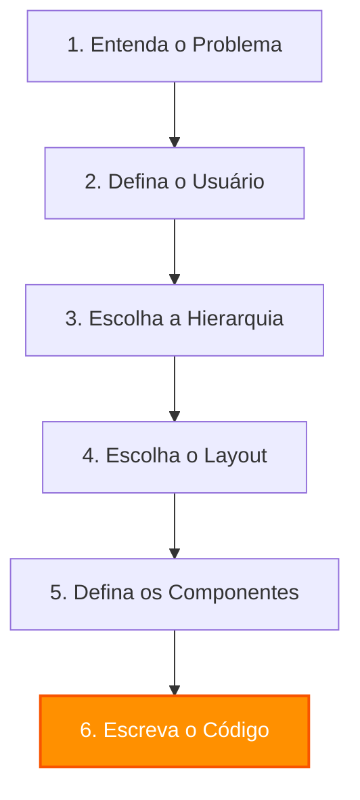

# design-process.md — Processo de Design e Pensamento do Claude

> **A Regra Inegociável:** Siga este processo sequencial em toda alteração visual ou funcional. 
> **Pense primeiro, code por último. Nunca inverta esta ordem.**

---

## O Fluxo de Pensamento Obrigatório

---

## 1. Entenda o Problema
Antes de encostar no código ou propor qualquer alteração visual, responda:
* Qual é a dor exata que esta tela ou fluxo resolve?
* Qual é a ação final de sucesso que o usuário deve completar aqui?
* O que acontece se o usuário falhar nessa ação? Como o sistema o recupera?

---

## 2. Defina o Usuário
Quem está operando esta interface neste exato momento?
* **O Franqueado (Dono de unidade no interior):**
  * *Contexto:* Está com pressa, opera muitas vezes pelo celular ou notebook simples, não quer fazer decisões estéticas, quer apenas preencher e baixar a arte.
  * *Decisão de Design:* Tema claro (`theme-light`), layout acolhedor, passos claros, poucas opções, botões de toque generosos, feedbacks claros de sucesso.
* **O Designer / Estúdio (Criador de templates):**
  * *Contexto:* Usuário profissional, acostumado com Figma/Photoshop, focado em precisão, quer controle fino sobre camadas, propriedades e regras de variáveis.
  * *Decisão de Design:* Tema escuro (padrão), alta densidade de informação, listas compactas, painéis expansíveis (disclosure progressivo), ferramentas organizadas em barras laterais e barras de ferramentas dedicadas.

---

## 3. Escolha a Hierarquia
O que é o herói da tela?
* Organize a página de modo que o item mais importante receba o maior peso visual. No catálogo, são os cards de template. No gerador, é a prévia da arte. No editor, é o canvas de trabalho.
* Garanta que nada concorra visualmente com o herói da tela. Elementos secundários devem ser silenciosos (tons de cinza suaves, ícones de traço fino, textos discretos).

---

## 4. Escolha o Layout
Como os elementos se distribuem no espaço?
* Planeje a estrutura de grid ou flexbox antes de posicionar elementos.
* Defina as margens e paddings de respiro da tela (`clamp()` fluido em vitrines para resoluções variadas).
* Siga a escala de espaçamento padrão do Luma baseada em múltiplos de 2 base 4.

---

## 5. Defina os Componentes
Quais peças serão usadas e como se conectam?
* Identifique e planeje os componentes (botões primários, chips, inputs com foco, badges de status, etc.) antes de codificar.
* **Consistência acima de criatividade:** Nunca crie um componente visual novo do zero se já houver um equivalente no design system. Reutilize e estenda.

---

## 6. Escreva o Código (Por último!)
Agora e apenas agora, implemente a solução em código:
* Use os tokens semânticos de cores e fontes para que ambos os temas funcionem nativamente.
* Siga o padrão de patch cirúrgico (sem quebras de CSS global, modificando o mínimo necessário e mantendo a consistência dos prefixos e ids).
* Teste todas as microinterações e transições descritas no `motion.md`.
